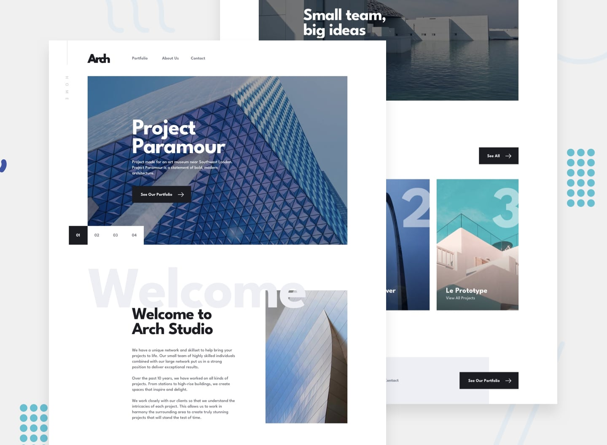

# 👨‍💻‍ Sobre o projeto

Arch Studio é a página de uma empresa fictícia de arquitetura, criada para
apresentar seus projetos, história e especialização em Design Urbano. O site tem
como objetivo proporcionar uma experiência elegante e profissional aos usuários,
refletindo a dedicação da empresa à qualidade e atenção aos detalhes.
A [ideia do design](https://www.frontendmentor.io/challenges/arch-studio-multipage-website-wNIbOFYR6)
veio de um desafio do frontend mentor.



## 💿 Como rodar na sua máquina

### Pré-requisitos

- **Git**;
- **Node + NPM**;

```shell
# Clone o repositório na sua máquina
$ git clone https://github.com/lleonardus/arch-studio

# Abra a pasta do projeto
$ cd arch-studio

# Instale as dependências
$ npm i

# Inicie o projeto
$ npm run dev
```

Após esse processo, o App vai estar rodando em **http://localhost:5173**

### 🧰 Ferramentas Utilizadas

- [Vite](https://vitejs.dev/)
- [React](https://react.dev/)
- [React Leaflet](https://react-leaflet.js.org/)
- [Leaflet](https://leafletjs.com/)
- [Tailwind](https://tailwindcss.com/)
- [NPM](https://docs.npmjs.com/downloading-and-installing-node-js-and-npm)
